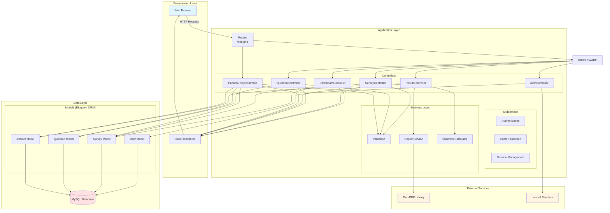

## Logical system architecture



## Architecture layers

### 1. Presentation layer

The presentation layer handles user interface and user interaction.

#### Components

**Web browser**
- Client-side interface
- Renders HTML/CSS/JavaScript
- Submits HTTP requests
- Displays responses

**Blade templates**
- Laravel's templating engine
- Server-side rendering
- Component-based views
- Template inheritance

**Key views:**
```
resources/views/
├── admin/
│   ├── dashboard.blade.php
│   ├── surveys/
│   │   ├── index.blade.php
│   │   ├── create.blade.php
│   │   ├── edit.blade.php
│   ├── questions/
│   │   ├── index.blade.php
│   │   ├── create.blade.php
│   ├── results/
│   │   ├── show.blade.php
│   │   └── pdf.blade.php
├── public/
│   └── survey.blade.php
└── auth/
    └── login.blade.php
```

---

### 2. Application layer

The application layer contains business logic and request handling.

#### Routing (routes/web.php)

Routes map HTTP requests to controllers:

```php
// Public routes
Route::get('/survey/{uuid}', [PublicSurveyController::class, 'show']);
Route::post('/survey/{uuid}', [PublicSurveyController::class, 'submit']);

// Admin routes (authenticated)
Route::middleware(['auth'])->prefix('admin')->group(function () {
    Route::get('/', [DashboardController::class, 'index']);
    Route::resource('surveys', SurveyController::class);
    Route::resource('surveys.questions', QuestionController::class);
    Route::get('surveys/{survey}/results', [ResultController::class, 'show']);
    Route::get('surveys/{survey}/export/csv', [ResultController::class, 'exportCsv']);
    Route::get('surveys/{survey}/export/pdf', [ResultController::class, 'exportPdf']);
});
```

#### Controllers

**AuthController**
- Handles user authentication
- Login/logout functionality
- Session management

**DashboardController**
- Displays admin dashboard
- Shows survey statistics
- Provides quick actions

**SurveyController**
- CRUD operations for surveys
- Survey activation/deactivation
- UUID generation

**QuestionController**
- CRUD operations for questions
- Question ordering
- Options management

**ResultController**
- Compiles survey analytics
- Generates charts and statistics
- Handles CSV/PDF exports

**PublicSurveyController**
- Displays public survey forms
- Validates and stores responses
- Handles anonymous submissions

#### Middleware

**Authentication middleware**
- Verifies user login status
- Redirects unauthenticated users
- Protects admin routes

**CSRF protection**
- Validates CSRF tokens
- Prevents cross-site request forgery
- Automatic token generation

**Session management**
- Maintains user sessions
- Stores flash messages
- Handles session persistence

#### Business logic

**Validation service**
- Request validation rules
- Custom validation logic
- Error message handling

```php
// Survey validation
$request->validate([
    'title' => ['required', 'string', 'max:255'],
    'description' => ['nullable', 'string'],
    'is_active' => ['nullable', 'boolean'],
]);

// Question validation
$request->validate([
    'text' => ['required', 'string', 'max:1000'],
    'type' => ['required', 'in:scale,multiple_choice,text'],
    'options' => ['nullable', 'string'],
    'required' => ['nullable', 'boolean'],
]);
```

**Export service**
- CSV generation
- PDF generation via DomPDF
- Data formatting

**Statistics calculator**
- Aggregates response data
- Calculates averages for scale questions
- Counts responses per option

---

### 3. Data layer

The data layer manages data persistence and retrieval.

#### Eloquent ORM models

**User model**
- Represents administrators
- Handles authentication
- Password hashing

**Survey model**
- Survey CRUD operations
- UUID generation
- Relationships to questions and answers

```php
class Survey extends Model
{
    protected $fillable = ['uuid', 'title', 'description', 'is_active'];
    
    protected $casts = ['is_active' => 'boolean'];
    
    public function questions(): HasMany
    {
        return $this->hasMany(Question::class)->orderBy('position');
    }
    
    public function answers(): HasMany
    {
        return $this->hasMany(Answer::class);
    }
}
```

**Question model**
- Question CRUD operations
- Options JSON casting
- Position ordering

```php
class Question extends Model
{
    protected $fillable = ['survey_id', 'text', 'type', 'options', 'required', 'position'];
    
    protected $casts = [
        'options' => 'array',
        'required' => 'boolean',
    ];
    
    public function survey(): BelongsTo
    {
        return $this->belongsTo(Survey::class);
    }
    
    public function answers(): HasMany
    {
        return $this->hasMany(Answer::class);
    }
}
```

**Answer model**
- Stores survey responses
- Links to survey and question
- Timestamp tracking

```php
class Answer extends Model
{
    protected $fillable = ['survey_id', 'question_id', 'response_value'];
    
    public function survey(): BelongsTo
    {
        return $this->belongsTo(Survey::class);
    }
    
    public function question(): BelongsTo
    {
        return $this->belongsTo(Question::class);
    }
}
```

#### Database (MySQL)

**Tables:**
- `users` - Administrator accounts
- `surveys` - Survey metadata
- `questions` - Survey questions
- `answers` - Survey responses

**Relationships:**
- Foreign keys with CASCADE delete
- Indexed columns for performance
- Unique constraints on UUID and email

---

### 4. External services

#### DomPDF library
- Converts HTML to PDF
- Used for PDF export functionality
- Configured via `config/dompdf.php`

```php
use Barryvdh\DomPDF\Facade\Pdf;

$pdf = Pdf::loadView('admin.results.pdf', compact('survey', 'results'));
return $pdf->download('survey-results.pdf');
```

#### Laravel Sanctum
- API token authentication
- SPA authentication
- CSRF protection for SPAs

---

## Data flow

### Admin creates survey

```
Browser → Routes → Auth Middleware → SurveyController
    → Validation → Survey Model → Database
    → Response → Blade Template → Browser
```

### Participant submits response

```
Browser → Routes → PublicSurveyController
    → Validation → Answer Model → Database
    → Response → Blade Template → Browser
```

### Admin exports results

```
Browser → Routes → Auth Middleware → ResultController
    → Statistics Calculator → Answer Model → Database
    → Export Service → DomPDF → PDF File → Browser
```

---

## Design patterns

### MVC (Model-View-Controller)
- **Models:** Eloquent ORM classes
- **Views:** Blade templates
- **Controllers:** Handle HTTP requests

### Repository pattern
- Eloquent models act as repositories
- Abstracts database operations
- Provides clean API for data access

### Service layer pattern
- Export service encapsulates export logic
- Statistics calculator encapsulates analytics
- Separates business logic from controllers

### Dependency injection
- Laravel's service container
- Automatic dependency resolution
- Testable code structure

---

## Security architecture

### Authentication
- Session-based authentication
- Password hashing (bcrypt)
- Remember me functionality

### Authorization
- Middleware-based route protection
- Admin-only access to management features
- Public access to survey forms

### Input validation
- Server-side validation
- CSRF token verification
- SQL injection prevention (Eloquent ORM)

### Data protection
- Prepared statements (PDO)
- XSS prevention (Blade escaping)
- Mass assignment protection

---

## Scalability considerations

### Database optimization
- Indexed foreign keys
- Composite indexes for analytics queries
- Efficient query design with Eloquent

### Caching opportunities
- Survey data caching
- Results caching
- Route caching
- Config caching

### Horizontal scaling
- Stateless application design
- Session storage in database/redis
- Load balancer compatible

### Performance optimization
- Eager loading relationships
- Query optimization
- Asset compilation and minification
