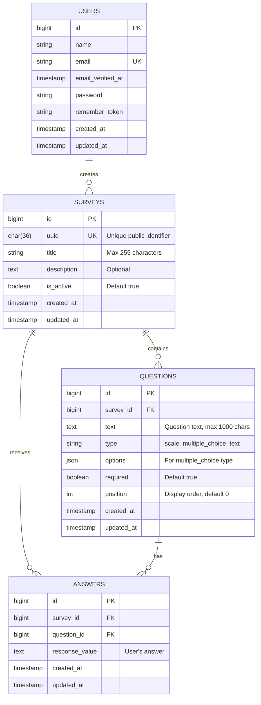

## Entity-relationship diagram



## Entities

### USERS
Represents authenticated administrators who manage surveys.

| Attribute | Type | Constraints | Description |
|-----------|------|-------------|-------------|
| `id` | bigint | PK, AUTO_INCREMENT | Primary key |
| `name` | varchar(255) | NOT NULL | User's full name |
| `email` | varchar(255) | NOT NULL, UNIQUE | Login email address |
| `email_verified_at` | timestamp | NULL | Email verification timestamp |
| `password` | varchar(255) | NOT NULL | Hashed password |
| `remember_token` | varchar(100) | NULL | Session persistence token |
| `created_at` | timestamp | NULL | Account creation timestamp |
| `updated_at` | timestamp | NULL | Last update timestamp |

**Indexes:**
- Primary key on `id`
- Unique index on `email`

---

### SURVEYS
Represents survey instances with metadata and configuration.

| Attribute | Type | Constraints | Description |
|-----------|------|-------------|-------------|
| `id` | bigint | PK, AUTO_INCREMENT | Primary key |
| `uuid` | char(36) | NOT NULL, UNIQUE | UUID for public URLs |
| `title` | varchar(255) | NOT NULL | Survey title |
| `description` | text | NULL | Optional description |
| `is_active` | boolean | NOT NULL, DEFAULT 1 | Public accessibility flag |
| `created_at` | timestamp | NULL | Creation timestamp |
| `updated_at` | timestamp | NULL | Last update timestamp |

**Indexes:**
- Primary key on `id`
- Unique index on `uuid`

**Business rules:**
- UUID is auto-generated on creation
- Only active surveys (`is_active = 1`) are accessible via public URLs
- Title is required and limited to 255 characters

---

### QUESTIONS
Represents individual questions within surveys.

| Attribute | Type | Constraints | Description |
|-----------|------|-------------|-------------|
| `id` | bigint | PK, AUTO_INCREMENT | Primary key |
| `survey_id` | bigint | FK, NOT NULL | Foreign key to surveys |
| `text` | text | NOT NULL | Question text (max 1000 chars) |
| `type` | varchar(255) | NOT NULL | Question type enum |
| `options` | json | NULL | Answer options for multiple_choice |
| `required` | boolean | NOT NULL, DEFAULT 1 | Whether answer is mandatory |
| `position` | int unsigned | NOT NULL, DEFAULT 0 | Display order |
| `created_at` | timestamp | NULL | Creation timestamp |
| `updated_at` | timestamp | NULL | Last update timestamp |

**Indexes:**
- Primary key on `id`
- Foreign key on `survey_id` references `surveys(id)`
- Index on `survey_id, position` for efficient ordering

**Foreign key constraints:**
- `survey_id` → `surveys(id)` ON DELETE CASCADE

**Business rules:**
- `type` must be one of: `scale`, `multiple_choice`, `text`
- `options` is required for `multiple_choice` type, must be JSON array
- Questions are ordered by `position` (ascending)
- Validation enforces max 1000 characters for `text`

**Question types:**

| Type | Description | Options | Validation |
|------|-------------|---------|------------|
| `scale` | Rating 1-5 | NULL | Response must be 1, 2, 3, 4, or 5 |
| `multiple_choice` | Predefined options | JSON array | Response must match one option |
| `text` | Free text | NULL | Any text value |

---

### ANSWERS
Represents individual responses to questions.

| Attribute | Type | Constraints | Description |
|-----------|------|-------------|-------------|
| `id` | bigint | PK, AUTO_INCREMENT | Primary key |
| `survey_id` | bigint | FK, NOT NULL | Foreign key to surveys |
| `question_id` | bigint | FK, NOT NULL | Foreign key to questions |
| `response_value` | text | NULL | User's answer |
| `created_at` | timestamp | NULL | Submission timestamp |
| `updated_at` | timestamp | NULL | Last update timestamp |

**Indexes:**
- Primary key on `id`
- Foreign key on `survey_id` references `surveys(id)`
- Foreign key on `question_id` references `questions(id)`
- Composite index on `survey_id, question_id` for analytics queries

**Foreign key constraints:**
- `survey_id` → `surveys(id)` ON DELETE CASCADE
- `question_id` → `questions(id)` ON DELETE CASCADE

**Business rules:**
- `response_value` can be NULL for optional questions
- For scale questions: stored as string "1" through "5"
- For multiple_choice: stored as selected option text
- For text questions: stored as submitted text

---

## Relationships

### USERS → SURVEYS (1:N)
**Relationship:** One user creates many surveys  
**Cardinality:** One-to-many  
**Implementation:** Future enhancement (currently not enforced)

**Notes:**
- Currently, the system doesn't track which user created which survey
- This relationship is planned for future implementation
- Would add `user_id` foreign key to `surveys` table

---

### SURVEYS → QUESTIONS (1:N)
**Relationship:** One survey contains many questions  
**Cardinality:** One-to-many (mandatory on question side)  
**Implementation:** `questions.survey_id` → `surveys.id`

**Cascade behavior:**
- Deleting a survey deletes all its questions
- Questions cannot exist without a survey

**Query example:**
```php
$survey->questions()->orderBy('position')->get();
```

---

### SURVEYS → ANSWERS (1:N)
**Relationship:** One survey receives many answers  
**Cardinality:** One-to-many  
**Implementation:** `answers.survey_id` → `surveys.id`

**Cascade behavior:**
- Deleting a survey deletes all its answers
- Enables efficient survey-level analytics

**Query example:**
```php
$survey->answers()->count();
```

---

### QUESTIONS → ANSWERS (1:N)
**Relationship:** One question has many answers  
**Cardinality:** One-to-many  
**Implementation:** `answers.question_id` → `questions.id`

**Cascade behavior:**
- Deleting a question deletes all its answers
- Enables question-level analytics

**Query example:**
```php
$question->answers()->pluck('response_value');
```

---

## Cardinality summary

| Relationship | Cardinality | Participation |
|--------------|-------------|---------------|
| USERS → SURVEYS | 1:N | Optional (future) |
| SURVEYS → QUESTIONS | 1:N | Mandatory (question must have survey) |
| SURVEYS → ANSWERS | 1:N | Optional (survey may have no responses) |
| QUESTIONS → ANSWERS | 1:N | Optional (question may have no responses) |

## Data integrity constraints

### Primary keys
All tables use auto-incrementing `bigint` primary keys for scalability.

### Foreign keys
All foreign keys enforce referential integrity with CASCADE delete:
- Deleting a survey removes all questions and answers
- Deleting a question removes all its answers
- Orphaned records are prevented

### Unique constraints
- `users.email` - Prevents duplicate accounts
- `surveys.uuid` - Ensures unique public URLs

### Check constraints
Enforced at application level:
- `questions.type` ∈ {scale, multiple_choice, text}
- `questions.text` length ≤ 1000 characters
- `surveys.title` length ≤ 255 characters
- Scale answers ∈ {1, 2, 3, 4, 5}

### Null constraints
- Required fields: `title`, `text`, `type`, `survey_id`, `question_id`
- Optional fields: `description`, `options`, `response_value`

## Normalization

The schema is in **Third Normal Form (3NF)**:

1. **1NF:** All attributes contain atomic values
2. **2NF:** No partial dependencies (all non-key attributes depend on entire primary key)
3. **3NF:** No transitive dependencies (non-key attributes don't depend on other non-key attributes)

**Design decisions:**
- `questions.options` stored as JSON for flexibility (denormalized for simplicity)
- `answers.response_value` stored as text (polymorphic based on question type)
- No separate `responses` table grouping answers by submission (simplified model)
