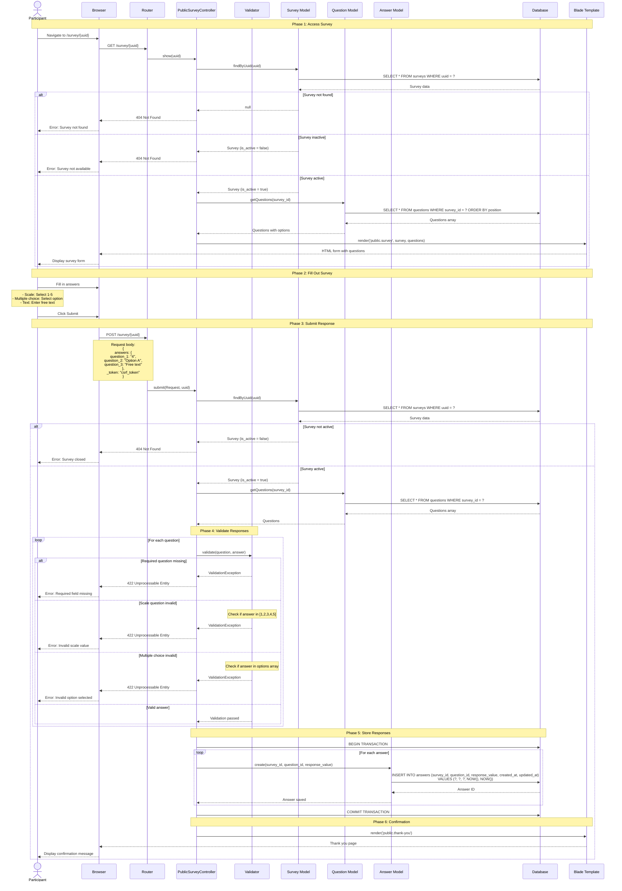

## Sequence diagram: Participant answers a survey



## Detailed flow description

### Phase 1: Access survey

**Step 1: Participant navigates to survey**
- Participant clicks survey link or enters URL
- URL format: `/survey/{uuid}` or `/s/{uuid}`
- Browser sends GET request to server

**Step 2: Route handling**
- Router matches URL pattern
- Dispatches to `PublicSurveyController::show()`
- Passes UUID parameter

**Step 3: Survey lookup**
- Controller calls `Survey::where('uuid', $uuid)->first()`
- Database query executes
- Returns survey record or null

**Step 4: Validation checks**
```php
if (!$survey) {
    abort(404, 'Survey not found');
}

if (!$survey->is_active) {
    abort(404, 'Survey is not available');
}
```

**Step 5: Load questions**
- Controller loads related questions
- Ordered by `position` field
- Includes options for multiple choice questions

```php
$questions = $survey->questions()->orderBy('position')->get();
```

**Step 6: Render form**
- Blade template receives survey and questions
- Generates HTML form with appropriate input types
- Returns to browser

---

### Phase 2: Fill out survey

**Participant interaction:**
- Views survey title and description
- Sees questions in order
- Fills in answers based on question type

**Question type rendering:**

| Type | HTML Input | Example |
|------|------------|---------|
| Scale | Radio buttons (1-5) | `<input type="radio" name="answers[1]" value="4">` |
| Multiple choice | Radio buttons or select | `<input type="radio" name="answers[2]" value="Option A">` |
| Text | Textarea | `<textarea name="answers[3]">Free text</textarea>` |

---

### Phase 3: Submit response

**Step 1: Form submission**
- Participant clicks Submit button
- Browser serializes form data
- Sends POST request with CSRF token

**Request payload:**
```json
{
  "answers": {
    "1": "4",
    "2": "Option A",
    "3": "User's free text response"
  },
  "_token": "csrf_token_value"
}
```

**Step 2: CSRF validation**
- Laravel middleware validates CSRF token
- Prevents cross-site request forgery
- Rejects invalid tokens with 419 error

**Step 3: Survey re-validation**
- Controller re-fetches survey by UUID
- Verifies survey still exists and is active
- Prevents race conditions

---

### Phase 4: Validate responses

**Validation rules by question type:**

**Scale questions:**
```php
$validator->addRules([
    "answers.{$question->id}" => [
        $question->required ? 'required' : 'nullable',
        'in:1,2,3,4,5'
    ]
]);
```

**Multiple choice questions:**
```php
$validator->addRules([
    "answers.{$question->id}" => [
        $question->required ? 'required' : 'nullable',
        Rule::in($question->options)
    ]
]);
```

**Text questions:**
```php
$validator->addRules([
    "answers.{$question->id}" => [
        $question->required ? 'required' : 'nullable',
        'string',
        'max:5000'
    ]
]);
```

**Validation errors:**
- Returns 422 Unprocessable Entity
- Includes error messages
- Browser displays validation errors
- Participant corrects and resubmits

---

### Phase 5: Store responses

**Transaction handling:**
```php
DB::transaction(function () use ($survey, $validatedAnswers) {
    foreach ($validatedAnswers as $questionId => $responseValue) {
        Answer::create([
            'survey_id' => $survey->id,
            'question_id' => $questionId,
            'response_value' => $responseValue,
        ]);
    }
});
```

**Database operations:**
1. Begin transaction
2. For each answer:
   - Insert into `answers` table
   - Set `survey_id`, `question_id`, `response_value`
   - Auto-populate `created_at` and `updated_at`
3. Commit transaction

**Transaction benefits:**
- Atomic operation (all or nothing)
- Prevents partial submissions
- Maintains data integrity

**Error handling:**
- Database errors trigger rollback
- No partial data saved
- Returns 500 error to user

---

### Phase 6: Confirmation

**Success response:**
- Controller returns success view
- Displays thank you message
- May show survey summary
- No ability to edit submitted responses

**Typical confirmation page:**
```html
<h1>Thank you!</h1>
<p>Your response has been recorded.</p>
<p>You may now close this window.</p>
```

---

## Alternative flows

### Survey not found

```
Participant → Browser → Router → Controller
    → Survey Model → Database (no match)
    → 404 Response → Browser → Error page
```

### Survey inactive

```
Participant → Browser → Router → Controller
    → Survey Model → Database (is_active = false)
    → 404 Response → Browser → Error page
```

### Validation failure

```
Participant → Browser → POST → Controller → Validator
    → Validation fails → 422 Response
    → Browser → Display errors → Participant corrects
```

### Database error

```
Participant → Browser → POST → Controller → Validator
    → Database → Error → Rollback transaction
    → 500 Response → Browser → Error page
```

---

## Timing considerations

| Operation | Typical Duration |
|-----------|------------------|
| Survey lookup | 5-10ms |
| Load questions | 10-20ms |
| Render template | 20-50ms |
| **Total page load** | **35-80ms** |
| Validate responses | 5-15ms |
| Save answers (5 questions) | 20-40ms |
| Transaction commit | 5-10ms |
| **Total submission** | **30-65ms** |

---

## Security measures

### CSRF protection
- Token generated on form load
- Validated on submission
- Prevents unauthorized submissions

### Input validation
- Server-side validation (never trust client)
- Type checking
- Length limits
- Whitelist validation for options

### SQL injection prevention
- Eloquent ORM uses prepared statements
- Parameter binding
- No raw SQL with user input

### Rate limiting
- Can be implemented via middleware
- Prevents spam submissions
- Configurable per route

---

## Error handling

### User-facing errors
- 404: Survey not found or inactive
- 422: Validation errors with specific messages
- 500: Server error (generic message)

### Logging
- Failed validations logged
- Database errors logged
- Stack traces in development mode

### Recovery
- Validation errors: User can correct and resubmit
- Server errors: User can retry
- Survey closed: No recovery, inform user
