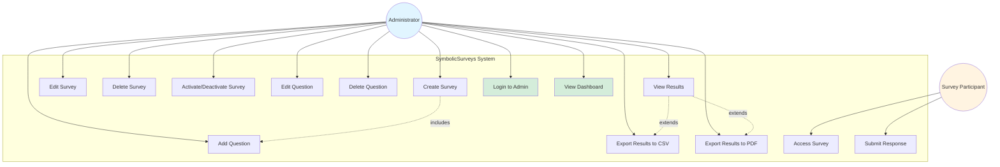

## Use case diagram

## Actors

### Administrator
The authenticated user who manages surveys through the admin dashboard.

**Responsibilities:**
- Create, edit, and delete surveys
- Manage survey activation status
- Add, edit, and delete questions
- View response analytics
- Export results in various formats

**Access:** Requires authentication via `/login`

### Survey participant
Anonymous or identified users who respond to surveys.

**Responsibilities:**
- Access public surveys via UUID link
- Submit responses to survey questions
- View survey description and instructions

**Access:** No authentication required, only valid survey UUID

## Use cases

### UC1: Create survey
**Actor:** Administrator  
**Precondition:** User is authenticated  
**Flow:**
1. Navigate to `/admin/surveys`
2. Click "Create Survey"
3. Enter title and optional description
4. Set active status
5. Submit form
6. System generates unique UUID
7. Survey is created

**Postcondition:** New survey exists and can accept questions

---

### UC2: Edit survey
**Actor:** Administrator  
**Precondition:** Survey exists  
**Flow:**
1. Navigate to survey list
2. Select survey to edit
3. Modify title, description, or status
4. Submit changes
5. System updates survey

**Postcondition:** Survey details are updated

---

### UC3: Delete survey
**Actor:** Administrator  
**Precondition:** Survey exists  
**Flow:**
1. Navigate to survey list
2. Select survey to delete
3. Confirm deletion
4. System removes survey and all related data

**Postcondition:** Survey, questions, and answers are permanently deleted

---

### UC4: Activate/deactivate survey
**Actor:** Administrator  
**Precondition:** Survey exists  
**Flow:**
1. Edit survey
2. Toggle `is_active` status
3. Submit changes
4. System updates survey status

**Postcondition:** Survey is accessible/inaccessible to participants

---

### UC5: Add question
**Actor:** Administrator  
**Precondition:** Survey exists  
**Flow:**
1. Navigate to survey questions
2. Click "Add Question"
3. Enter question text
4. Select question type (scale/multiple choice/text)
5. Configure options if multiple choice
6. Set required flag and position
7. Submit form
8. System creates question

**Postcondition:** Question is added to survey

---

### UC6: Edit question
**Actor:** Administrator  
**Precondition:** Question exists  
**Flow:**
1. Navigate to survey questions
2. Select question to edit
3. Modify text, type, options, or settings
4. Submit changes
5. System updates question

**Postcondition:** Question details are updated

---

### UC7: Delete question
**Actor:** Administrator  
**Precondition:** Question exists  
**Flow:**
1. Navigate to survey questions
2. Select question to delete
3. Confirm deletion
4. System removes question and related answers

**Postcondition:** Question and its answers are deleted

---

### UC8: View results
**Actor:** Administrator  
**Precondition:** Survey has responses  
**Flow:**
1. Navigate to survey results
2. System compiles analytics
3. Display charts and statistics
4. Show response counts and averages

**Postcondition:** Results are displayed

---

### UC9: Export results to CSV
**Actor:** Administrator  
**Precondition:** Survey has responses  
**Flow:**
1. View survey results
2. Click "Export CSV"
3. System generates CSV file
4. File downloads to user's device

**Postcondition:** CSV file contains all responses

---

### UC10: Export results to PDF
**Actor:** Administrator  
**Precondition:** Survey has responses  
**Flow:**
1. View survey results
2. Click "Export PDF"
3. System generates PDF report
4. File downloads to user's device

**Postcondition:** PDF file contains formatted results

---

### UC11: Access survey
**Actor:** Survey participant  
**Precondition:** Survey is active  
**Flow:**
1. Navigate to `/survey/{uuid}` or `/s/{uuid}`
2. System validates UUID and active status
3. Display survey title and description
4. Show all questions in order

**Postcondition:** Survey form is displayed

---

### UC12: Submit response
**Actor:** Survey participant  
**Precondition:** Survey is accessible  
**Flow:**
1. Fill out survey questions
2. System validates required fields
3. System validates answer formats
4. Submit form
5. System stores answers
6. Display confirmation message

**Postcondition:** Responses are saved to database

---

### UC13: Login to admin
**Actor:** Administrator  
**Precondition:** User has valid credentials  
**Flow:**
1. Navigate to `/login`
2. Enter email and password
3. Submit credentials
4. System authenticates user
5. Redirect to admin dashboard

**Postcondition:** User is authenticated

---

### UC14: View dashboard
**Actor:** Administrator  
**Precondition:** User is authenticated  
**Flow:**
1. Navigate to `/admin`
2. System displays dashboard
3. Show survey statistics and quick actions

**Postcondition:** Dashboard is displayed

## Relationships

### Includes
- **Create Survey** includes **Add Question** - Creating a survey typically involves adding questions

### Extends
- **Export Results to CSV** extends **View Results** - Optional action when viewing results
- **Export Results to PDF** extends **View Results** - Optional action when viewing results
